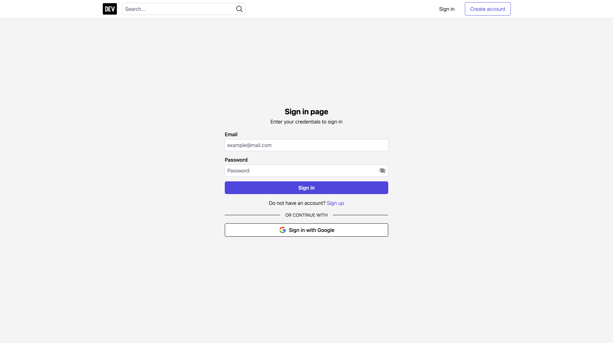

<h1 align="center">MERN DEV Clone Website - Frontend</h1>

## Contents

- [Brief description](#brief-description)
- [Language and Tools](#language-and-tools)
- [Project details](#project-details)
- [Images](#images)

## Brief description

- This is DEV Clone Website built with MERN stack. (The official website of DEV: [https://dev.to/ ](https://dev.to/))
- Project link (GitHub): [Backend side](https://github.com/phamgiaphuc/dev-website-clone-backend) and [Frontend side](https://github.com/phamgiaphuc/dev-website-clone-frontend)
- Project's author: Pham Gia Phuc - Acus
- Personal profile: [MyProfile](https://github.com/phamgiaphuc)

## Language and Tools

- Backend

- Frontend

- Other tools:

## Project details

A DEV clone website with some main features:

1. Authentication and Authorization

- [x] Sign in and up with email and password
- [x] Sign in with Google authentication (Firebase authentication)
- [x] Verfied account with a code sent to the user's email by Google email
- [x] Access and refresh token (OAuth2 authorization framework)
- [x] Authorized user by roles: user and admin
- [x] Sign out logic

2. User

- [x] Update profile page: User's information and images (Firebase storage)
- [x] Display profile page with user's information and blogs
- [ ] Renter user's password
- [ ] Create post/blog page
- [ ] Dashboard page with user's post and relevant infos

3. Blog

- [ ] Editor page
- [ ] Preview page
- [ ] Blog page

4. Others

- [ ] Home page
- [ ] Search page
- [ ] Info page

## Images

1. Authentication and Authorization

- Sign in and up with email and password; with Google authentication

- Verfied account with a code sent to the user's email by Google email

